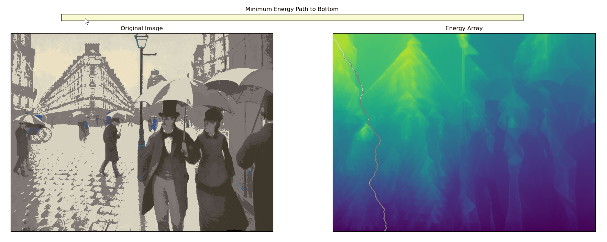
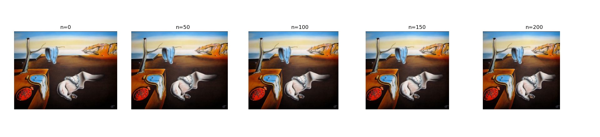

# Image Seam Carving
We implement the seam carving algorithm within Python in order to shrink an image without loss of important content or scale. Importance is defined here as the magnitude of edges, which is found via the use of convolutions with Sobel operators.

# Minimum Energy Path Visualiser

# Seam Carving Example

